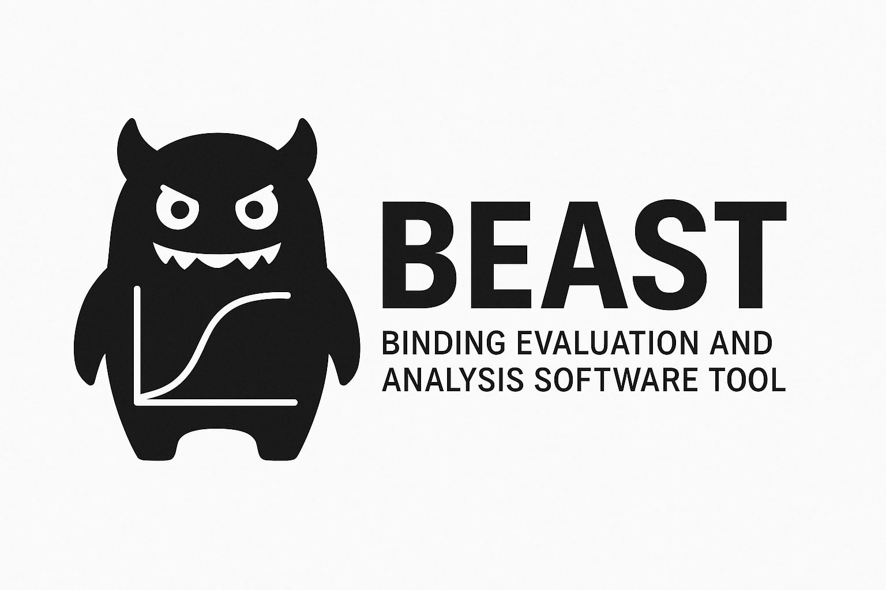

# BEAST - Binding Evaluation and Analysis Software Tool

This Python-based analysis tool is designed for evaluating titration data from NMR experiments. It fits experimental chemical shift data to multiple thermodynamic binding models and estimates association constants. The tool supports batch analysis, model fitting, statistical diagnostics, and reproducible outputs.



---

## Features

- **Model Support**:
  - Includes HG, H₂G, HG₂, and H₂G + HG binding models
  - Model logic is modularized – easily extendable via the `models/` folder

- **Flexible Fitting & Configuration**:
  - Curve fitting using `scipy.optimize.curve_fit`
  - Smart initial guess refinement strategy to avoid poor local minima
  - All key settings (initial guesses, bounds, residual test thresholds) configurable via `config.yaml`

- **Detailed Fit Diagnostics** (grouped and structured):
  - **Criteria**:
    - R², RMSE, Weighted RMSE, AIC, BIC
  - **Main Tests**:
    - Normality check
    - Ljung-Box test (autocorrelation)
    - Ramsey RESET test (model misspecification)
    - Lag-1 Pearson & Spearman correlation of residuals
    - Rolling R² analysis (local structure detection)
  - **Optional Tests**:
    - Spectral energy ratio (low-frequency pattern detection)
    - Runs test (sign clustering via run ratio)
    - Zero-crossing white-noise similarity
    - Cook’s Distance (outlier/influence detection)
    - Breusch-Godfrey / White’s test (auxiliary regression on lagged residuals)

- **Visualization**:
  - Fitted curve vs experimental Δδ
  - Raw and normalized residuals
  - Optional colored model overlays

- **Structured Output**:
  - Results saved in CSV format (per model and per point)
  - Diagnostic plots saved as PNG
  - Human-readable diagnostic tables in log

- **User Experience**:
  - Logging to terminal and `results/log.txt`
  - Fully modular code structure for reuse and testing
  - CLI interface with customizable options for quick runs
  - Google Colab compatible for web/cloud use

---

## How to Use

### Option 1: Google Colab

Launch in [Google Colab](https://colab.research.google.com/github/Deam0on/mysak_delta_iso/blob/main/example_data/colab_template.ipynb)

Set of experimental data can be found under `example_data/`

### Option 2: Run Locally

1. Clone the repository:

```bash
git clone https://github.com/Deam0on/mysak_delta_iso.git
cd mysak_delta_iso/binding_analysis
```

2. Install dependencies:

```bash
pip install -r requirements.txt
```

3. Place `.csv` files into the `data_input/` directory.

4. Run the tool:

```bash
python binding_analysis_tool.py [OPTIONS]
```

### Available Options:

| Argument            | Description |
|---------------------|-------------|
| `--config PATH`     | Path to custom `config.yaml` file (default: `config.yaml`) |
| `--input_dir DIR`   | Override input folder path (default: `data_input`) |
| `--output_dir DIR`  | Override output folder path (default: `results`) |
| `--skip_tests`      | Disable residual diagnostics like Ljung-Box, BG/White, RESET, Cook’s Distance |
| `--no_normalized`   | Suppress normalized residual plots (Δδ-relative) from output |

### Example:

```bash
python binding_analysis_tool.py \
  --input_dir custom_data \
  --output_dir custom_results \
  --skip_tests \
  --no_normalized
```

5. Review the output in the `results/` folder:
   - `*_results.csv`: fit parameters and stats
   - `*_plot.png`: fit and residuals
   - `log.txt`: execution log

---

## Input File Format

All data used in the paper is uploaded in `example_data/` folder

See [Input Format and File Structure](https://github.com/Deam0on/mysak_delta_iso/wiki/Input_and_File_Structure)

---

## Binding Models — Equations and Definitions

This repository includes multiple binding models used to fit NMR titration data. Below are the corresponding equations and definitions of parameters.

For detailed model description, see [Binding Models and Theory](https://github.com/Deam0on/mysak_delta_iso/wiki/Binding_Models_and_Theory)

---

## Residual Diagnostics

A rich suite of statistical diagnostics is applied to each model's residuals, grouped into:

- **Criteria metrics** (e.g., R², AIC)
- **Main diagnostics** (e.g., Ljung-Box, RESET)
- **Optional residual pattern checks** (e.g., Pearson/Spearman correlation, spectral energy ratio)

These are rendered into a per-model table for easy comparison.

See the [Residual Diagnostics wiki page](https://github.com/Deam0on/mysak_delta_iso/wiki/Residual_Diagnostics) for test details, acceptable values, and interpretation.

---

## Output Summary

Each run creates a `results/` folder with:

- Per-sample **CSV summaries** (with fit, residuals, metrics, flags)
- Per-sample **plots**: data, residuals, and optionally normalized residuals
- A comprehensive **log.txt** with step-by-step model evaluation

---
## Additional Resources

- [Project Wiki](https://github.com/Deam0on/mysak_delta_iso/wiki)

For questions or contributions, open an issue or pull request on the [GitHub repo](https://github.com/Deam0on/mysak_delta_iso).

---

## License

This project is released under the MIT License. See `LICENSE` for details.

## Support this project

You can support me via [liberpay](https://liberapay.com/Deamoon)
